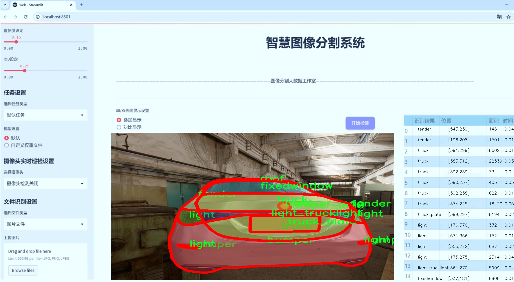
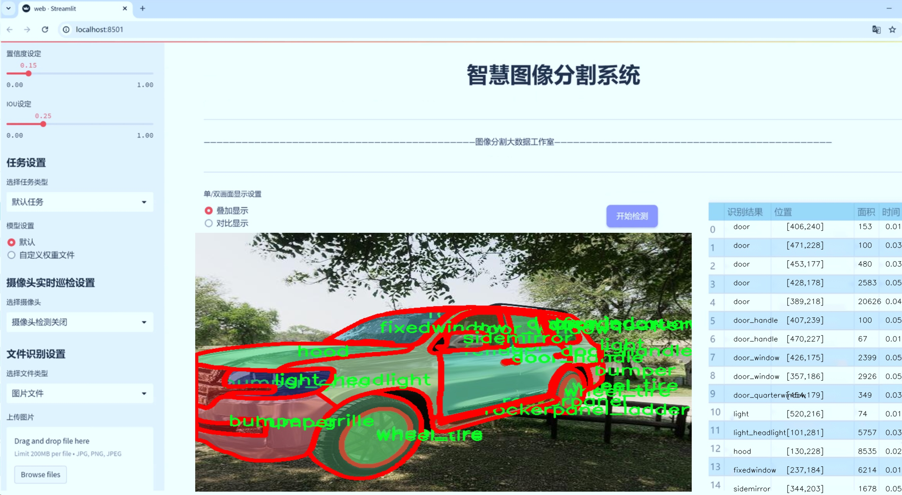
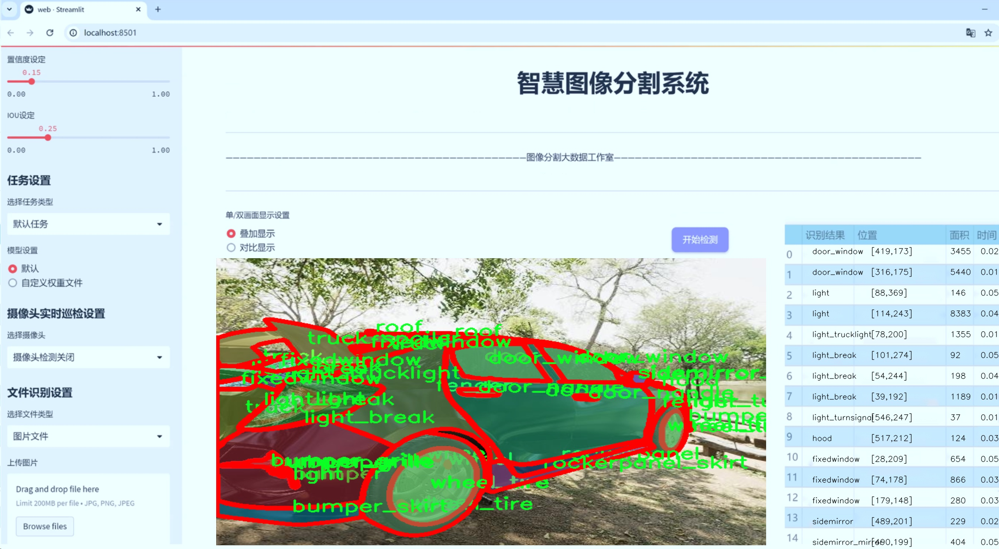
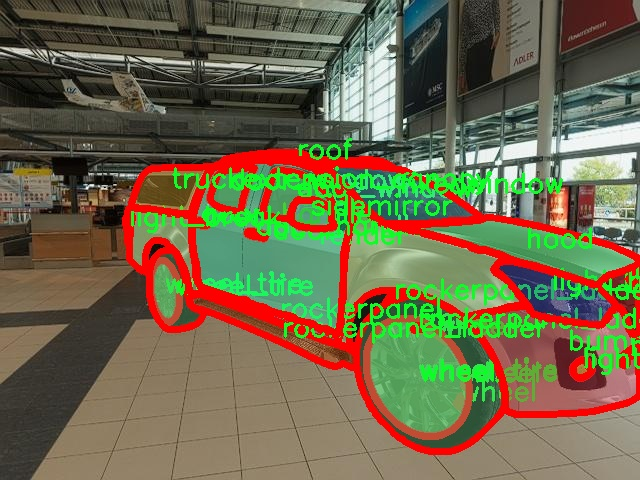
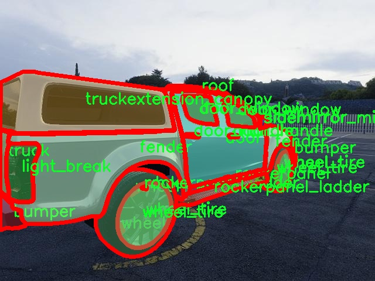
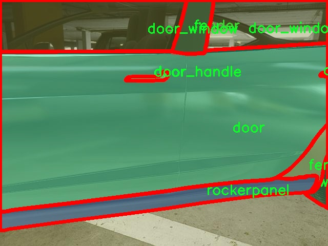
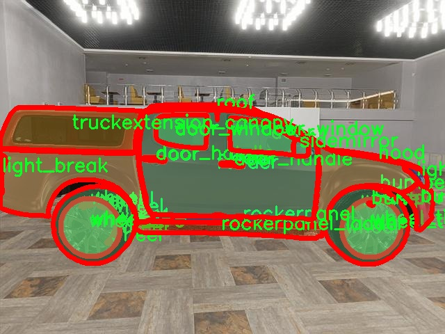
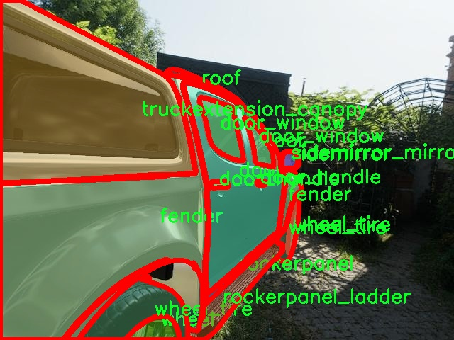

# 汽车零部件图像分割系统源码＆数据集分享
 [yolov8-seg-C2f-DCNV3＆yolov8-seg-C2f-SCcConv等50+全套改进创新点发刊_一键训练教程_Web前端展示]

### 1.研究背景与意义

项目参考[ILSVRC ImageNet Large Scale Visual Recognition Challenge](https://gitee.com/YOLOv8_YOLOv11_Segmentation_Studio/projects)

项目来源[AAAI Global Al lnnovation Contest](https://kdocs.cn/l/cszuIiCKVNis)

研究背景与意义

随着汽车工业的迅猛发展，汽车零部件的设计、生产和维护愈发依赖于高效的图像处理技术。汽车零部件的多样性和复杂性使得传统的人工识别和分类方法面临诸多挑战，尤其是在大规模生产和维护的背景下，如何快速、准确地识别和分割汽车零部件成为了一个亟待解决的问题。近年来，深度学习技术的飞速发展为这一领域带来了新的机遇，尤其是目标检测和图像分割技术的进步，使得基于计算机视觉的自动化识别成为可能。

YOLO（You Only Look Once）系列模型因其实时性和高准确率在目标检测领域取得了显著成就。YOLOv8作为该系列的最新版本，进一步提升了模型的性能，尤其是在小目标检测和复杂场景下的表现。然而，尽管YOLOv8在目标检测方面表现优异，但在汽车零部件的实例分割任务中仍存在一定的局限性。汽车零部件的形状、颜色和纹理各异，且在不同的拍摄角度和光照条件下可能会出现较大的变化，这对模型的鲁棒性提出了更高的要求。因此，基于改进YOLOv8的汽车零部件图像分割系统的研究具有重要的现实意义。

本研究将基于一个包含10,000张图像和40个类别的汽车零部件数据集，针对汽车零部件的实例分割任务进行深入探索。该数据集涵盖了从保险杠、车门到车轮等多种零部件，提供了丰富的样本和多样的场景，能够有效支持模型的训练和验证。通过对YOLOv8模型的改进，结合数据集的特性，我们旨在提升模型在汽车零部件分割任务中的表现，尤其是在小目标和复杂背景下的分割精度。

本研究的意义不仅在于提升汽车零部件的自动识别和分割能力，更在于推动智能制造和智能维护的发展。通过实现高效的零部件图像分割系统，可以为汽车生产线的自动化检测、故障诊断以及后续的维护提供有力支持，降低人工成本，提高生产效率。此外，该系统的成功应用还将为汽车零部件的智能化管理提供数据基础，促进汽车产业的数字化转型。

综上所述，基于改进YOLOv8的汽车零部件图像分割系统的研究，不仅具有重要的学术价值，也具备广泛的应用前景。通过本研究，我们希望能够为汽车工业的智能化发展贡献一份力量，同时为相关领域的研究提供新的思路和方法。

### 2.图片演示







##### 注意：由于此博客编辑较早，上面“2.图片演示”和“3.视频演示”展示的系统图片或者视频可能为老版本，新版本在老版本的基础上升级如下：（实际效果以升级的新版本为准）

  （1）适配了YOLOV8的“目标检测”模型和“实例分割”模型，通过加载相应的权重（.pt）文件即可自适应加载模型。

  （2）支持“图片识别”、“视频识别”、“摄像头实时识别”三种识别模式。

  （3）支持“图片识别”、“视频识别”、“摄像头实时识别”三种识别结果保存导出，解决手动导出（容易卡顿出现爆内存）存在的问题，识别完自动保存结果并导出到tempDir中。

  （4）支持Web前端系统中的标题、背景图等自定义修改，后面提供修改教程。

  另外本项目提供训练的数据集和训练教程,暂不提供权重文件（best.pt）,需要您按照教程进行训练后实现图片演示和Web前端界面演示的效果。

### 3.视频演示

[3.1 视频演示](https://www.bilibili.com/video/BV1FGmiYtEve/)

### 4.数据集信息展示

##### 4.1 本项目数据集详细数据（类别数＆类别名）

nc: 40
names: ['bumper', 'bumper_grille', 'bumper_logo', 'bumper_plate', 'bumper_skirt', 'door', 'door_handle', 'door_quarterwindow', 'door_window', 'fender', 'fender_fuelcover', 'fender_quarterwindow', 'fender_wheelbrow', 'fixedwindow', 'hood', 'hood_extension', 'light', 'light_break', 'light_fog', 'light_headlight', 'light_trucklight', 'light_turnsignal', 'rockerpanel', 'rockerpanel_ladder', 'rockerpanel_skirt', 'roof', 'roof_window', 'sidemirror', 'sidemirror_mirror', 'truck', 'truck_logo', 'truck_plate', 'truck_spoiler', 'truckextension_cabinet', 'truckextension_canopy', 'truckextension_compressor', 'truckextension_lid', 'truckextension_skeleton', 'wheel', 'wheel_tire']


##### 4.2 本项目数据集信息介绍

数据集信息展示

在现代汽车工业中，零部件的精确识别与分割是提升生产效率和质量控制的重要环节。为此，我们构建了一个名为“Car Part”的数据集，旨在为改进YOLOv8-seg的汽车零部件图像分割系统提供强有力的支持。该数据集包含40个类别，涵盖了汽车外部和内部的各个零部件，确保了模型在多样化场景下的鲁棒性和准确性。

“Car Part”数据集的类别包括：保险杠（bumper）、保险杠格栅（bumper_grille）、保险杠标志（bumper_logo）、保险杠板（bumper_plate）、保险杠裙（bumper_skirt）、车门（door）、门把手（door_handle）、车门后窗（door_quarterwindow）、车门窗（door_window）、翼子板（fender）、翼子板油箱盖（fender_fuelcover）、翼子板后窗（fender_quarterwindow）、翼子板轮眉（fender_wheelbrow）、固定窗（fixedwindow）、引擎盖（hood）、引擎盖延伸部分（hood_extension）、灯具（light）、刹车灯（light_break）、雾灯（light_fog）、前大灯（light_headlight）、货车灯（light_trucklight）、转向灯（light_turnsignal）、侧裙（rockerpanel）、侧裙梯（rockerpanel_ladder）、侧裙裙（rockerpanel_skirt）、车顶（roof）、车顶窗（roof_window）、侧视镜（sidemirror）、侧视镜镜面（sidemirror_mirror）、货车（truck）、货车标志（truck_logo）、货车牌照（truck_plate）、货车扰流板（truck_spoiler）、货车扩展柜（truckextension_cabinet）、货车扩展篷（truckextension_canopy）、货车扩展压缩机（truckextension_compressor）、货车扩展盖（truckextension_lid）、货车扩展骨架（truckextension_skeleton）、车轮（wheel）以及轮胎（wheel_tire）。这些类别的选择不仅反映了汽车设计的复杂性，也为模型的训练提供了丰富的样本。

数据集中的图像经过精心挑选，确保涵盖不同品牌、型号和颜色的汽车，以提高模型的泛化能力。每个类别的图像都经过标注，确保每个零部件在图像中的位置和形状都被准确记录。这种细致的标注工作为模型提供了清晰的学习目标，使其能够在实际应用中实现高效的图像分割。

此外，数据集还考虑了不同的拍摄角度、光照条件和背景环境，以模拟真实世界中可能遇到的各种情况。这种多样性使得“Car Part”数据集不仅适用于YOLOv8-seg的训练，也为其他计算机视觉任务提供了宝贵的参考。通过对这些数据的深入分析和学习，模型将能够更好地理解汽车零部件的特征，从而在分割任务中表现出色。

总之，“Car Part”数据集的构建旨在推动汽车零部件图像分割技术的发展，为研究人员和工程师提供一个高质量的训练资源。随着深度学习技术的不断进步，我们期待该数据集能够为未来的汽车智能化、自动驾驶等领域带来更多的创新和突破。











### 5.全套项目环境部署视频教程（零基础手把手教学）

[5.1 环境部署教程链接（零基础手把手教学）](https://www.bilibili.com/video/BV1jG4Ve4E9t/?vd_source=bc9aec86d164b67a7004b996143742dc)


[5.2 安装Python虚拟环境创建和依赖库安装视频教程链接（零基础手把手教学）](https://www.bilibili.com/video/BV1nA4VeYEze/?vd_source=bc9aec86d164b67a7004b996143742dc)

### 6.手把手YOLOV8-seg训练视频教程（零基础小白有手就能学会）

[6.1 手把手YOLOV8-seg训练视频教程（零基础小白有手就能学会）](https://www.bilibili.com/video/BV1cA4VeYETe/?vd_source=bc9aec86d164b67a7004b996143742dc)


按照上面的训练视频教程链接加载项目提供的数据集，运行train.py即可开始训练



     Epoch   gpu_mem       box       obj       cls    labels  img_size
     1/200     0G   0.01576   0.01955  0.007536        22      1280: 100%|██████████| 849/849 [14:42<00:00,  1.04s/it]
               Class     Images     Labels          P          R     mAP@.5 mAP@.5:.95: 100%|██████████| 213/213 [01:14<00:00,  2.87it/s]
                 all       3395      17314      0.994      0.957      0.0957      0.0843

     Epoch   gpu_mem       box       obj       cls    labels  img_size
     2/200     0G   0.01578   0.01923  0.007006        22      1280: 100%|██████████| 849/849 [14:44<00:00,  1.04s/it]
               Class     Images     Labels          P          R     mAP@.5 mAP@.5:.95: 100%|██████████| 213/213 [01:12<00:00,  2.95it/s]
                 all       3395      17314      0.996      0.956      0.0957      0.0845

     Epoch   gpu_mem       box       obj       cls    labels  img_size
     3/200     0G   0.01561    0.0191  0.006895        27      1280: 100%|██████████| 849/849 [10:56<00:00,  1.29it/s]
               Class     Images     Labels          P          R     mAP@.5 mAP@.5:.95: 100%|███████   | 187/213 [00:52<00:00,  4.04it/s]
                 all       3395      17314      0.996      0.957      0.0957      0.0845


### 7.50+种全套YOLOV8-seg创新点代码加载调参视频教程（一键加载写好的改进模型的配置文件）

[7.1 50+种全套YOLOV8-seg创新点代码加载调参视频教程（一键加载写好的改进模型的配置文件）](https://www.bilibili.com/video/BV1Hw4VePEXv/?vd_source=bc9aec86d164b67a7004b996143742dc)

### 8.YOLOV8-seg图像分割算法原理

原始YOLOv8-seg算法原理

YOLOv8-seg算法是YOLO系列目标检测算法的最新进展，结合了目标检测与实例分割的能力，标志着计算机视觉领域的又一次技术飞跃。YOLO（You Only Look Once）系列自其诞生以来，便以其高效的实时检测能力和相对较低的计算资源需求而受到广泛关注。YOLOv8的推出不仅在检测精度和速度上进行了优化，同时也在模型结构上进行了创新，尤其是在处理复杂场景下的目标分割任务方面。

YOLOv8-seg的核心思想在于将目标检测与实例分割任务有效结合，利用深度学习技术实现对图像中多个目标的精确定位和分割。与传统的目标检测方法不同，YOLOv8-seg采用了一种全新的解耦头结构，这一结构将分类和回归任务分开处理，使得模型在处理复杂场景时能够更专注于每个任务，从而提高了分类精度和定位准确性。这种解耦设计不仅减少了任务间的干扰，还允许模型在面对不同的目标特征时，能够灵活调整其学习策略。

在YOLOv8-seg中，主干网络依然采用了CSP（Cross Stage Partial）结构，这种结构通过分割特征图并在不同阶段进行处理，极大地提高了特征提取的效率。特征增强网络则采用了PAN-FPN（Path Aggregation Network with Feature Pyramid Network）的思想，通过多层次的特征融合，增强了模型对不同尺度目标的检测能力。PAN-FPN的设计理念在于通过高效的特征路径聚合，使得模型能够在多尺度特征之间建立更为紧密的联系，从而提升了目标检测的整体性能。

YOLOv8-seg的另一大创新在于其Anchor-free的目标检测方法。传统的目标检测方法通常依赖于预定义的锚框，这不仅增加了模型的复杂性，还在不同尺度和形状的目标检测中面临诸多挑战。而YOLOv8-seg通过回归方式直接预测目标的位置和大小，省去了锚框的定义和调整过程，使得模型能够更快速地聚焦于目标的实际位置。这种方法的引入，使得YOLOv8-seg在处理多样化目标时表现出更高的灵活性和准确性。

在实例分割方面，YOLOv8-seg通过引入像素级的分割信息，进一步提升了目标检测的精度。通过对每个目标的像素级别的处理，YOLOv8-seg能够实现对目标的精确边界提取。这一能力在复杂场景下尤为重要，例如在农业应用中，YOLOv8-seg能够有效区分不同的水果或植物，帮助自动化采摘机器人进行精确的目标识别和路径规划。

此外，YOLOv8-seg在模型的轻量化设计上也做出了显著的贡献。相较于之前的YOLO版本，YOLOv8-seg的权重文件进一步减小，使得其能够在资源受限的嵌入式设备上高效运行。这一特性使得YOLOv8-seg在实时检测和处理速度上具备了更大的优势，能够满足各种实际应用场景的需求。

在实际应用中，YOLOv8-seg展现出了强大的适应性和灵活性。例如，在农业领域，该算法可以用于苹果的自动检测与定位，通过结合视觉识别与路径规划算法，自动化采摘机器人能够快速而准确地完成采摘任务。这不仅提高了工作效率，还降低了人工成本，推动了农业生产的智能化进程。

总的来说，YOLOv8-seg算法通过创新的网络结构和高效的目标检测策略，为目标检测与实例分割领域带来了新的思路和解决方案。其在准确性、速度和轻量化方面的综合提升，使得YOLOv8-seg不仅在学术研究中具有重要的价值，也在实际应用中展现出了广泛的前景。随着技术的不断进步，YOLOv8-seg无疑将成为计算机视觉领域的重要工具，为更多行业的智能化发展提供强有力的支持。


### 9.系统功能展示（检测对象为举例，实际内容以本项目数据集为准）

图9.1.系统支持检测结果表格显示

  图9.2.系统支持置信度和IOU阈值手动调节

  图9.3.系统支持自定义加载权重文件best.pt(需要你通过步骤5中训练获得)

  图9.4.系统支持摄像头实时识别

  图9.5.系统支持图片识别

  图9.6.系统支持视频识别

  图9.7.系统支持识别结果文件自动保存

  图9.8.系统支持Excel导出检测结果数据


### 10.50+种全套YOLOV8-seg创新点原理讲解（非科班也可以轻松写刊发刊，V11版本正在科研待更新）

#### 10.1 由于篇幅限制，每个创新点的具体原理讲解就不一一展开，具体见下列网址中的创新点对应子项目的技术原理博客网址【Blog】：


[10.1 50+种全套YOLOV8-seg创新点原理讲解链接](https://gitee.com/qunmasj/good)

#### 10.2 部分改进模块原理讲解(完整的改进原理见上图和技术博客链接)【如果此小节的图加载失败可以通过CSDN或者Github搜索该博客的标题访问原始博客，原始博客图片显示正常】
### YOLOv8简介
YOLO（You Only Look Once）是一种流行的对象检测和图像分割模型，由华盛顿大学的Joseph Redmon和Ali Farhadi开发。YOLO于2015年推出，以其高速度和高精度迅速走红。

YOLOv2于2016年发布，通过合并批处理规范化、锚盒和维度集群来改进原始模型
2018年推出的YOLOv3使用更高效的骨干网络、多个锚点和空间金字塔池进一步增强了该模型的性能
YOLOv4于2020年发布，引入了Mosaic数据增强、新的无锚检测头和新的丢失功能等创新
YOLOv5进一步提高了模型的性能，并添加了超参数优化、集成实验跟踪和自动导出到流行导出格式等新功能
YOLOv6于2022年由美团开源，目前正在该公司的许多自动配送机器人中使用
YOLOv7在COCO关键点数据集上添加了额外的任务，如姿态估计
YOLOv8是Ultralytics公司推出的YOLO的最新版本。作为一款尖端、最先进的（SOTA）车型，YOLOv8在之前版本的成功基础上，引入了新的功能和改进，以增强性能、灵活性和效率。YOLOv8支持全方位的视觉AI任务，包括检测、分割、姿态估计、跟踪和分类。这种多功能性允许用户在不同的应用程序和域中利用YOLOv8的功能
#### YOLOv8的新特性与可用模型

Ultralytics 并没有直接将开源库命名为 YOLOv8，而是直接使用 ultralytics 这个词，原因是 ultralytics 将这个库定位为算法框架，而非某一个特定算法，一个主要特点是可扩展性。其希望这个库不仅仅能够用于 YOLO 系列模型，而是能够支持非 YOLO 模型以及分类分割姿态估计等各类任务。总而言之，ultralytics 开源库的两个主要优点是：

融合众多当前 SOTA 技术于一体
未来将支持其他 YOLO 系列以及 YOLO 之外的更多算法
Ultralytics为YOLO模型发布了一个全新的存储库。它被构建为 用于训练对象检测、实例分割和图像分类模型的统一框架。

提供了一个全新的 SOTA 模型，包括 P5 640 和 P6 1280 分辨率的目标检测网络和基于 YOLACT 的实例分割模型。和 YOLOv5 一样，基于缩放系数也提供了 N/S/M/L/X 尺度的不同大小模型，用于满足不同场景需求
骨干网络和 Neck 部分可能参考了 YOLOv7 ELAN 设计思想，将 YOLOv5 的 C3 结构换成了梯度流更丰富的 C2f 结构，并对不同尺度模型调整了不同的通道数，属于对模型结构精心微调，不再是无脑一套参数应用所有模型，大幅提升了模型性能。不过这个 C2f 模块中存在 Split 等操作对特定硬件部署没有之前那么友好了
Head 部分相比 YOLOv5 改动较大，换成了目前主流的解耦头结构，将分类和检测头分离，同时也从 Anchor-Based 换成了 Anchor-Free
Loss 计算方面采用了 TaskAlignedAssigner 正样本分配策略，并引入了 Distribution Focal Loss
训练的数据增强部分引入了 YOLOX 中的最后 10 epoch 关闭 Mosiac 增强的操作，可以有效地提升精度
YOLOv8 还高效灵活地支持多种导出格式，并且该模型可以在 CPU 和 GPU 上运行。YOLOv8 模型的每个类别中有五个模型用于检测、分割和分类。YOLOv8 Nano 是最快和最小的，而 YOLOv8 Extra Large (YOLOv8x) 是其中最准确但最慢的。


### FocalModulation模型的基本原理
参考该博客，Focal Modulation Networks（FocalNets）的基本原理是替换自注意力（Self-Attention）模块，使用焦点调制（focal modulation）机制来捕捉图像中的长距离依赖和上下文信息。下图是自注意力和焦点调制两种方法的对比。


自注意力要求对每个查询令牌（Query Token）与其他令牌进行复杂的查询-键（Query-Key）交互和查询-值（Query-Value）聚合，以计算注意力分数并捕捉上下文。而焦点调制则先将空间上下文以不同粒度聚合到调制器中，然后以查询依赖的方式将这些调制器注入到查询令牌中。焦点调制简化了交互和聚合操作，使其更轻量级。在图中，自注意力部分使用红色虚线表示查询-键交互和黄色虚线表示查询-值聚合，而焦点调制部分则用蓝色表示调制器聚合和黄色表示查询-调制器交互。 

FocalModulation模型通过以下步骤实现：

1. 焦点上下文化：用深度卷积层堆叠来编码不同范围的视觉上下文。


2. 门控聚合：通过门控机制，选择性地将上下文信息聚合到每个查询令牌的调制器中。


3. 逐元素仿射变换：将聚合后的调制器通过仿射变换注入到每个查询令牌中。

下面来分别介绍这三个机制->

#### 焦点上下文化
焦点上下文化（Focal Contextualization）是焦点调制（Focal Modulation）的一个组成部分。焦点上下文化使用一系列深度卷积层（depth-wise convolutional layers）来编码不同范围内的视觉上下文信息。这些层可以捕捉从近处到远处的视觉特征，从而允许网络在不同层次上理解图像内容。通过这种方式，网络能够在聚合上下文信息时保持对局部细节的敏感性，并增强对全局结构的认识。


​

这张图详细比较了自注意力（Self-Attention, SA）和焦点调制（Focal Modulation）的机制，并特别展示了焦点调制中的上下文聚合过程。左侧的图展示了自注意力模型如何通过键（k）和查询（q）之间的交互，以及随后的聚合来生成输出。而中间和右侧的图说明了焦点调制如何通过层级化的上下文聚合和门控聚合过程替代自注意力模型的这一过程。在焦点调制中，输入首先通过轻量级线性层进行处理，然后通过层级化的上下文化模块和门控机制来选择性地聚合信息，最终通过调制器与查询（q）进行交互以生成输出。

#### 门控聚合
在Focal Modulation Networks（FocalNets）中的 "门控聚合"（Gated Aggregation）是关键组件之一，这一过程涉及使用门控机制来选择性地聚合上下文信息。以下是这个过程的详细分析：

1. 什么是门控机制？
门控机制在深度学习中常用于控制信息流。它通常用于决定哪些信息应该被传递，哪些应该被阻断。在循环神经网络（RNN）中，特别是在长短期记忆网络（LSTM）和门控循环单元（GRU）中，门控机制用于调节信息在时间序列数据中的流动。

2. 门控聚合的目的
在FocalNets中，门控聚合的目的是为每个查询令牌（即处理中的数据单元）选择性地聚合上下文信息。这意味着网络能够决定哪些特定的上下文信息对于当前处理的查询令牌是重要的，从而专注于那些最相关的信息。

3. 如何实现门控聚合？
实现门控聚合可能涉及一系列计算步骤，其中包括：

计算上下文信息：这可能涉及使用深度卷积层（如文中提到的）对输入图像的不同区域进行编码，以捕捉从局部到全局的视觉上下文。
门控操作：这一步骤涉及到一个决策过程，根据当前查询令牌的特征来决定哪些上下文信息是相关的。这可能通过一个学习到的权重（门）来实现，该权重决定了不同上下文信息的重要性。
信息聚合：最后，根据门控操作的结果，选择性地聚合上下文信息到一个调制器中。这个调制器随后被用于调整或“调制”查询令牌的表示。
4. 门控聚合的好处
通过门控聚合，FocalNets能够更有效地聚焦于对当前任务最关键的信息。这种方法提高了模型的效率和性能，因为它减少了不必要信息的处理，同时增强了对关键特征的关注。在视觉任务中，这可能意味着更好的目标检测和图像分类性能，特别是在复杂或多变的视觉环境中。

总结：门控聚合是FocalNets的一个核心组成部分，它通过选择性地集中处理重要的上下文信息来提升网络的效率和性能。

#### 逐元素仿射变换
在Focal Modulation Networks（FocalNets）中的第三个关键组件是逐元素仿射变换，这个步骤涉及将通过门控聚合得到的调制器注入到每个查询令牌中。以下是该过程的详细分析：

1. 仿射变换的基本概念：
仿射变换是一种线性变换，用于对数据进行缩放、旋转、平移和倾斜等操作。在深度学习中，逐元素的仿射变换通常指的是对每个元素进行线性变换，这种变换可以被描述为y = ax + b，其中x是输入，y是输出，a和b是变换的参数。

2. 逐元素仿射变换的作用：
在FocalNets中，逐元素仿射变换的作用是将聚合后的调制器信息注入到每个查询令牌中。这个步骤对于整合上下文信息和查询令牌的原始特征非常重要。通过这种方式，调制器所包含的上下文信息可以直接影响查询令牌的表示。

3. 执行仿射变换：
执行这一步骤时，聚合后的调制器对每个查询令牌进行逐元素的仿射变换。在实践中，这可能意味着对查询令牌的每个特征应用调制器中的相应权重（a）和偏差（b）。这样，调制器中的每个元素都直接对应于查询令牌的一个特征，通过调整这些特征来改变其表达。

4. 仿射变换的效果：
通过逐元素仿射变换，模型能够更细致地调整每个查询令牌的特征，根据上下文信息来增强或抑制某些特征。这种精细的调整机制允许网络更好地适应复杂的视觉场景，提高对细节的捕捉能力，从而提升了模型在各种视觉任务中的性能，如目标检测和图像分类。

总结：逐元素仿射变换它使得模型能够利用上下文信息来有效地调整查询令牌，增强了模型对关键视觉特征的捕捉和表达能力。


### 11.项目核心源码讲解（再也不用担心看不懂代码逻辑）

#### 11.1 ultralytics\data\utils.py

以下是对您提供的代码的核心部分进行分析和注释。代码主要涉及图像和数据集的处理，特别是与YOLO（You Only Look Once）目标检测模型相关的功能。

```python
import os
import hashlib
import numpy as np
from PIL import Image, ImageOps
from ultralytics.utils import check_class_names, yaml_load, check_file

IMG_FORMATS = 'bmp', 'jpeg', 'jpg', 'png', 'tif', 'tiff'  # 支持的图像格式

def img2label_paths(img_paths):
    """根据图像路径生成对应的标签路径。"""
    sa, sb = f'{os.sep}images{os.sep}', f'{os.sep}labels{os.sep}'  # 定义图像和标签的子目录
    return [sb.join(x.rsplit(sa, 1)).rsplit('.', 1)[0] + '.txt' for x in img_paths]

def get_hash(paths):
    """返回文件或目录路径列表的单一哈希值。"""
    size = sum(os.path.getsize(p) for p in paths if os.path.exists(p))  # 计算路径列表中所有文件的总大小
    h = hashlib.sha256(str(size).encode())  # 使用SHA-256算法生成哈希
    h.update(''.join(paths).encode())  # 更新哈希值
    return h.hexdigest()  # 返回哈希值

def verify_image(im_file):
    """验证单个图像文件的完整性和格式。"""
    nf, nc, msg = 0, 0, ''  # nf: 找到的图像数, nc: 损坏的图像数
    try:
        im = Image.open(im_file)  # 打开图像文件
        im.verify()  # 验证图像文件
        shape = im.size  # 获取图像尺寸
        assert (shape[0] > 9) & (shape[1] > 9), f'image size {shape} <10 pixels'  # 确保图像尺寸大于10像素
        assert im.format.lower() in IMG_FORMATS, f'invalid image format {im.format}'  # 确保图像格式有效
        nf = 1  # 找到的图像数加1
    except Exception as e:
        nc = 1  # 损坏的图像数加1
        msg = f'WARNING ⚠️ {im_file}: ignoring corrupt image: {e}'  # 记录损坏图像的警告信息
    return im_file, nf, nc, msg  # 返回图像文件及其验证结果

def check_det_dataset(dataset, autodownload=True):
    """
    检查目标检测数据集的可用性，必要时下载并解压数据集。
    
    Args:
        dataset (str): 数据集路径或描述符（如YAML文件）。
        autodownload (bool): 如果未找到数据集，是否自动下载。默认为True。
    
    Returns:
        (dict): 解析后的数据集信息和路径。
    """
    data = check_file(dataset)  # 检查数据集文件的存在性

    # 下载（可选）
    if isinstance(data, (str, Path)) and (data.endswith('.zip') or data.endswith('.tar')):
        # 如果数据集是压缩文件，则下载并解压
        new_dir = safe_download(data, dir=DATASETS_DIR, unzip=True, delete=False)
        data = find_dataset_yaml(DATASETS_DIR / new_dir)  # 查找解压后的YAML文件

    # 读取YAML文件
    if isinstance(data, (str, Path)):
        data = yaml_load(data, append_filename=True)  # 解析YAML文件为字典

    # 检查数据集的必要字段
    for k in 'train', 'val':
        if k not in data:
            raise SyntaxError(f"{dataset} '{k}:' key missing ❌. Required in all data YAMLs.")
    
    # 确保数据集的类名和数量一致
    if 'names' not in data and 'nc' not in data:
        raise SyntaxError(f"{dataset} key missing ❌. Either 'names' or 'nc' are required in all data YAMLs.")
    
    if 'names' in data and 'nc' in data and len(data['names']) != data['nc']:
        raise SyntaxError(f"{dataset} 'names' length {len(data['names'])} and 'nc: {data['nc']}' must match.")
    
    if 'names' not in data:
        data['names'] = [f'class_{i}' for i in range(data['nc'])]  # 如果没有类名，生成默认类名

    # 解析数据集路径
    path = Path(data.get('path') or data.get('yaml_file', '')).parent  # 数据集根目录
    data['path'] = path  # 更新数据集路径

    return data  # 返回数据集信息字典
```

### 核心功能分析
1. **图像与标签路径转换**：`img2label_paths`函数将图像路径转换为对应的标签路径，便于后续处理。
2. **哈希生成**：`get_hash`函数生成文件路径列表的哈希值，用于快速验证文件的完整性。
3. **图像验证**：`verify_image`函数检查图像文件的完整性和格式，确保图像符合预期的标准。
4. **数据集检查与下载**：`check_det_dataset`函数负责检查数据集的可用性，并在必要时下载和解压数据集，确保数据集的结构和内容符合YOLO模型的要求。

这些核心功能为YOLO模型的训练和推理提供了必要的数据预处理和验证步骤。

该文件是Ultralytics YOLO项目中的一个工具模块，主要用于处理数据集相关的功能，包括图像和标签的验证、数据集的下载和解析、图像的处理等。以下是对文件中主要功能的逐一说明。

首先，文件导入了一系列必要的库，包括标准库（如`os`、`hashlib`、`json`等）和第三方库（如`cv2`、`numpy`、`PIL`等），这些库为后续的功能实现提供了支持。

文件定义了一些常量，例如支持的图像和视频格式，以及全局的内存固定设置。这些常量在后续的函数中被频繁使用，以确保程序的灵活性和可配置性。

接下来，文件中定义了一些函数。`img2label_paths`函数用于根据图像路径生成对应的标签路径，方便后续的标签验证。`get_hash`函数则用于计算给定路径列表的哈希值，以便于检测文件或目录的变化。

`exif_size`函数用于获取图像的EXIF信息并返回修正后的图像尺寸，主要用于处理JPEG格式的图像。`verify_image`和`verify_image_label`函数分别用于验证单张图像和图像-标签对的有效性，包括检查图像格式、尺寸、完整性等。

文件中还包含了一些与多边形和掩膜相关的函数，如`polygon2mask`和`polygons2masks`，这些函数用于将多边形转换为二进制掩膜，适用于分割任务。

`find_dataset_yaml`函数用于查找与数据集相关的YAML文件，确保数据集的配置文件能够被正确加载。`check_det_dataset`和`check_cls_dataset`函数则用于验证和下载检测和分类数据集，确保数据集的完整性和可用性。

此外，文件中定义了一个`HUBDatasetStats`类，用于生成HUB数据集的统计信息和JSON文件。该类在初始化时会检查数据集的有效性，并提供方法来处理图像和生成统计信息。

最后，文件中还定义了一些辅助函数，如`compress_one_image`用于压缩图像，`autosplit`用于自动划分数据集为训练、验证和测试集。

总体而言，该文件为YOLO模型提供了丰富的数据处理功能，确保在训练和评估过程中能够高效地管理和验证数据集。

#### 11.2 ultralytics\models\sam\build.py

以下是代码中最核心的部分，并附上详细的中文注释：

```python
import torch
from functools import partial

from .modules.decoders import MaskDecoder
from .modules.encoders import ImageEncoderViT, PromptEncoder
from .modules.sam import Sam
from .modules.tiny_encoder import TinyViT
from .modules.transformer import TwoWayTransformer

def _build_sam(encoder_embed_dim,
               encoder_depth,
               encoder_num_heads,
               encoder_global_attn_indexes,
               checkpoint=None,
               mobile_sam=False):
    """构建选定的SAM模型架构。"""
    
    # 定义提示嵌入维度和图像尺寸
    prompt_embed_dim = 256
    image_size = 1024
    vit_patch_size = 16
    image_embedding_size = image_size // vit_patch_size  # 计算图像嵌入尺寸

    # 根据是否为移动SAM选择不同的图像编码器
    image_encoder = (TinyViT(
        img_size=1024,
        in_chans=3,
        num_classes=1000,
        embed_dims=encoder_embed_dim,
        depths=encoder_depth,
        num_heads=encoder_num_heads,
        window_sizes=[7, 7, 14, 7],
        mlp_ratio=4.0,
        drop_rate=0.0,
        drop_path_rate=0.0,
        use_checkpoint=False,
        mbconv_expand_ratio=4.0,
        local_conv_size=3,
    ) if mobile_sam else ImageEncoderViT(
        depth=encoder_depth,
        embed_dim=encoder_embed_dim,
        img_size=image_size,
        mlp_ratio=4,
        norm_layer=partial(torch.nn.LayerNorm, eps=1e-6),
        num_heads=encoder_num_heads,
        patch_size=vit_patch_size,
        qkv_bias=True,
        use_rel_pos=True,
        global_attn_indexes=encoder_global_attn_indexes,
        window_size=14,
        out_chans=prompt_embed_dim,
    ))

    # 创建SAM模型实例
    sam = Sam(
        image_encoder=image_encoder,  # 图像编码器
        prompt_encoder=PromptEncoder(
            embed_dim=prompt_embed_dim,
            image_embedding_size=(image_embedding_size, image_embedding_size),
            input_image_size=(image_size, image_size),
            mask_in_chans=16,
        ),
        mask_decoder=MaskDecoder(
            num_multimask_outputs=3,
            transformer=TwoWayTransformer(
                depth=2,
                embedding_dim=prompt_embed_dim,
                mlp_dim=2048,
                num_heads=8,
            ),
            transformer_dim=prompt_embed_dim,
            iou_head_depth=3,
            iou_head_hidden_dim=256,
        ),
        pixel_mean=[123.675, 116.28, 103.53],  # 像素均值
        pixel_std=[58.395, 57.12, 57.375],      # 像素标准差
    )

    # 如果提供了检查点，则加载模型权重
    if checkpoint is not None:
        checkpoint = attempt_download_asset(checkpoint)  # 尝试下载检查点
        with open(checkpoint, 'rb') as f:
            state_dict = torch.load(f)  # 加载权重
        sam.load_state_dict(state_dict)  # 将权重加载到模型中

    sam.eval()  # 设置模型为评估模式
    return sam  # 返回构建的SAM模型
```

### 代码核心部分解释：
1. **导入必要的模块**：导入了PyTorch和一些自定义模块，用于构建和解码模型。
2. **_build_sam函数**：这是构建SAM模型的核心函数。根据传入的参数配置不同的编码器（图像编码器和提示编码器），并创建一个完整的SAM模型。
3. **图像编码器选择**：根据是否是移动版本选择不同的编码器架构（TinyViT或ImageEncoderViT）。
4. **模型实例化**：创建SAM模型实例，包含图像编码器、提示编码器和掩码解码器。
5. **加载检查点**：如果提供了模型检查点，尝试下载并加载模型权重。
6. **评估模式**：将模型设置为评估模式，以便在推理时禁用某些训练时的操作（如Dropout）。

这个程序文件是用于构建和返回“Segment Anything Model”（SAM）模型的，主要包括不同大小的模型构建函数以及一个通用的构建函数。文件的开头包含版权信息和许可证声明，接着导入了一些必要的库和模块。

程序中定义了多个函数来构建不同大小的SAM模型，包括`build_sam_vit_h`、`build_sam_vit_l`、`build_sam_vit_b`和`build_mobile_sam`。每个函数都调用了一个私有的构建函数`_build_sam`，并传入特定的参数，这些参数包括编码器的嵌入维度、深度、头数以及全局注意力索引等。每个模型的配置参数不同，旨在满足不同的需求和性能要求。

`_build_sam`函数是模型构建的核心，负责创建具体的模型架构。它首先定义了一些常量，如提示嵌入维度、图像大小和图像编码器的补丁大小。根据是否构建移动版本的SAM，选择不同的图像编码器：如果是移动版本，则使用`TinyViT`，否则使用`ImageEncoderViT`。接着，创建了SAM模型的实例，包含图像编码器、提示编码器和掩码解码器等组件。

在构建模型时，如果提供了检查点（checkpoint），程序会尝试下载并加载该检查点的状态字典，以便恢复模型的权重。最后，模型被设置为评估模式。

程序还定义了一个字典`samm_model_map`，将模型文件名映射到相应的构建函数，以便根据给定的检查点文件名来选择合适的模型构建函数。`build_sam`函数是外部接口，允许用户通过指定检查点文件名来构建相应的SAM模型。如果提供的检查点不在支持的模型列表中，程序会抛出一个文件未找到的异常。

总体来说，这个文件的主要功能是提供一个灵活的接口来构建不同配置的SAM模型，支持从预训练的检查点加载模型权重，以便进行后续的推理或训练。

#### 11.3 ultralytics\trackers\bot_sort.py

以下是代码中最核心的部分，并附上详细的中文注释：

```python
class BOTrack(STrack):
    """
    BOTrack类是STrack类的扩展，增加了目标跟踪功能。
    """

    shared_kalman = KalmanFilterXYWH()  # 共享的卡尔曼滤波器实例

    def __init__(self, tlwh, score, cls, feat=None, feat_history=50):
        """初始化BOTrack实例，设置初始参数，包括特征历史、平滑因子和当前特征。"""
        super().__init__(tlwh, score, cls)  # 调用父类构造函数

        self.smooth_feat = None  # 平滑特征向量
        self.curr_feat = None  # 当前特征向量
        if feat is not None:
            self.update_features(feat)  # 更新特征
        self.features = deque([], maxlen=feat_history)  # 存储特征向量的双端队列
        self.alpha = 0.9  # 指数移动平均的平滑因子

    def update_features(self, feat):
        """更新特征向量，并使用指数移动平均进行平滑处理。"""
        feat /= np.linalg.norm(feat)  # 归一化特征向量
        self.curr_feat = feat  # 更新当前特征
        if self.smooth_feat is None:
            self.smooth_feat = feat  # 如果平滑特征为空，则直接赋值
        else:
            # 使用指数移动平均更新平滑特征
            self.smooth_feat = self.alpha * self.smooth_feat + (1 - self.alpha) * feat
        self.features.append(feat)  # 将当前特征添加到特征队列
        self.smooth_feat /= np.linalg.norm(self.smooth_feat)  # 归一化平滑特征

    def predict(self):
        """使用卡尔曼滤波器预测均值和协方差。"""
        mean_state = self.mean.copy()  # 复制当前均值状态
        if self.state != TrackState.Tracked:
            mean_state[6] = 0  # 如果状态不是跟踪状态，重置速度
            mean_state[7] = 0

        # 预测新的均值和协方差
        self.mean, self.covariance = self.kalman_filter.predict(mean_state, self.covariance)

    @property
    def tlwh(self):
        """获取当前边界框位置，格式为 (左上角 x, 左上角 y, 宽度, 高度)。"""
        if self.mean is None:
            return self._tlwh.copy()  # 如果均值为空，返回原始边界框
        ret = self.mean[:4].copy()  # 复制均值的前四个元素
        ret[:2] -= ret[2:] / 2  # 计算左上角坐标
        return ret

    @staticmethod
    def multi_predict(stracks):
        """使用共享的卡尔曼滤波器预测多个目标轨迹的均值和协方差。"""
        if len(stracks) <= 0:
            return  # 如果没有轨迹，直接返回
        multi_mean = np.asarray([st.mean.copy() for st in stracks])  # 获取所有轨迹的均值
        multi_covariance = np.asarray([st.covariance for st in stracks])  # 获取所有轨迹的协方差
        for i, st in enumerate(stracks):
            if st.state != TrackState.Tracked:
                multi_mean[i][6] = 0  # 如果状态不是跟踪状态，重置速度
                multi_mean[i][7] = 0
        # 使用共享的卡尔曼滤波器进行多目标预测
        multi_mean, multi_covariance = BOTrack.shared_kalman.multi_predict(multi_mean, multi_covariance)
        for i, (mean, cov) in enumerate(zip(multi_mean, multi_covariance)):
            stracks[i].mean = mean  # 更新轨迹均值
            stracks[i].covariance = cov  # 更新轨迹协方差
```

### 代码核心部分解释：
1. **BOTrack类**：这是一个用于目标跟踪的类，继承自STrack类，增加了特征更新和卡尔曼滤波预测的功能。
2. **共享卡尔曼滤波器**：`shared_kalman`是一个静态属性，所有BOTrack实例共享同一个卡尔曼滤波器，用于状态预测。
3. **特征更新**：`update_features`方法用于更新当前特征，并使用指数移动平均平滑特征向量。
4. **预测功能**：`predict`方法使用卡尔曼滤波器预测目标的状态，包括均值和协方差。
5. **边界框格式**：`tlwh`属性返回当前目标的边界框位置，格式为左上角坐标和宽高。
6. **多目标预测**：`multi_predict`静态方法用于同时预测多个目标的状态，利用共享的卡尔曼滤波器提高效率。

这个程序文件 `bot_sort.py` 是用于实现基于 YOLOv8 的目标跟踪算法的，主要包括两个类：`BOTrack` 和 `BOTSORT`。`BOTrack` 类是对 `STrack` 类的扩展，增加了目标跟踪的功能，而 `BOTSORT` 类则是对 `BYTETracker` 类的扩展，旨在结合 ReID（重识别）和 GMC（全局运动一致性）算法进行目标跟踪。

在 `BOTrack` 类中，首先定义了一些属性，包括共享的卡尔曼滤波器、平滑特征向量、当前特征向量、特征历史记录的双端队列、平滑因子和卡尔曼滤波器的均值与协方差矩阵。该类提供了多种方法，例如 `update_features` 用于更新特征向量并使用指数移动平均进行平滑，`predict` 用于使用卡尔曼滤波器预测均值和协方差，`re_activate` 用于重新激活跟踪，`update` 用于更新 YOLOv8 实例，`tlwh` 属性用于获取当前的边界框位置等。

`BOTSORT` 类则负责初始化跟踪、计算轨迹与检测之间的距离、以及多目标预测等功能。它的构造函数接收参数并初始化一些阈值和 GMC 实例。`init_track` 方法用于根据检测结果初始化跟踪对象，`get_dists` 方法计算轨迹与检测之间的距离，包括 IoU 和可选的 ReID 嵌入距离，`multi_predict` 方法则用于对多个对象进行预测和跟踪。

整体来看，这个文件实现了一个高效的目标跟踪系统，结合了卡尔曼滤波、特征平滑和重识别技术，能够在视频流中对多个目标进行实时跟踪。使用时，用户可以创建 `BOTSORT` 的实例，并通过提供检测结果、分数和类别等信息来初始化和更新跟踪。

#### 11.4 ultralytics\engine\predictor.py

以下是经过简化并添加详细中文注释的核心代码部分：

```python
import platform
from pathlib import Path
import cv2
import numpy as np
import torch
from ultralytics.cfg import get_cfg, get_save_dir
from ultralytics.data import load_inference_source
from ultralytics.nn.autobackend import AutoBackend
from ultralytics.utils import LOGGER, callbacks, colorstr
from ultralytics.utils.checks import check_imgsz
from ultralytics.utils.torch_utils import select_device, smart_inference_mode

class BasePredictor:
    """
    BasePredictor类用于创建预测器的基类。
    """

    def __init__(self, cfg='DEFAULT_CFG', overrides=None, _callbacks=None):
        """
        初始化BasePredictor类。

        参数:
            cfg (str, optional): 配置文件路径，默认为'DEFAULT_CFG'。
            overrides (dict, optional): 配置覆盖，默认为None。
        """
        self.args = get_cfg(cfg, overrides)  # 获取配置
        self.save_dir = get_save_dir(self.args)  # 获取保存结果的目录
        self.done_warmup = False  # 是否完成预热
        self.model = None  # 初始化模型为None
        self.dataset = None  # 初始化数据集为None
        self.callbacks = _callbacks or callbacks.get_default_callbacks()  # 获取回调函数

    def preprocess(self, im):
        """
        在推理之前准备输入图像。

        参数:
            im (torch.Tensor | List(np.ndarray)): 输入图像。

        返回:
            torch.Tensor: 处理后的图像。
        """
        if not isinstance(im, torch.Tensor):
            im = np.stack(im)  # 将输入转换为张量
            im = im[..., ::-1].transpose((0, 3, 1, 2))  # BGR转RGB，调整维度
            im = torch.from_numpy(im).to(self.device)  # 转换为张量并移动到设备上
        return im.half() if self.model.fp16 else im.float()  # 转换数据类型

    def inference(self, im):
        """
        对给定图像进行推理。

        参数:
            im (torch.Tensor): 输入图像。

        返回:
            预测结果。
        """
        return self.model(im)  # 使用模型进行推理

    def __call__(self, source=None, model=None, stream=False):
        """
        对图像或流进行推理。

        参数:
            source: 输入源。
            model: 使用的模型。
            stream: 是否为流模式。
        """
        if stream:
            return self.stream_inference(source, model)  # 流推理
        else:
            return list(self.stream_inference(source, model))  # 非流推理

    def setup_source(self, source):
        """
        设置输入源和推理模式。

        参数:
            source: 输入源。
        """
        self.imgsz = check_imgsz(self.args.imgsz)  # 检查图像大小
        self.dataset = load_inference_source(source=source, imgsz=self.imgsz)  # 加载数据集

    @smart_inference_mode()
    def stream_inference(self, source=None, model=None):
        """
        实时推理流并将结果保存到文件。

        参数:
            source: 输入源。
            model: 使用的模型。
        """
        if not self.model:
            self.setup_model(model)  # 设置模型

        self.setup_source(source if source is not None else self.args.source)  # 设置输入源

        for batch in self.dataset:  # 遍历数据集
            im0s = batch[1]  # 获取原始图像
            im = self.preprocess(im0s)  # 预处理图像
            preds = self.inference(im)  # 进行推理
            # 处理和保存结果的逻辑省略...

    def setup_model(self, model):
        """
        初始化YOLO模型并设置为评估模式。

        参数:
            model: 使用的模型。
        """
        self.model = AutoBackend(model)  # 初始化模型
        self.model.eval()  # 设置为评估模式
```

### 代码说明
1. **BasePredictor类**: 这是一个基类，用于处理图像推理的基本逻辑。
2. **初始化方法**: `__init__`方法用于初始化配置、保存目录和模型等。
3. **预处理方法**: `preprocess`方法将输入图像转换为适合模型推理的格式。
4. **推理方法**: `inference`方法使用模型对输入图像进行推理。
5. **调用方法**: `__call__`方法根据输入源的类型选择推理方式（流或非流）。
6. **设置输入源**: `setup_source`方法负责加载输入源和图像大小的检查。
7. **流推理方法**: `stream_inference`方法实现实时推理，并在每个批次中进行图像处理和推理。
8. **模型设置**: `setup_model`方法用于初始化和配置YOLO模型。

这些核心部分和注释提供了对代码的基本理解，适合希望深入了解YOLO推理过程的开发者。

这个程序文件 `ultralytics/engine/predictor.py` 是一个用于图像、视频等数据源的预测引擎，主要用于YOLO（You Only Look Once）模型的推理。文件开头的文档字符串详细说明了该程序的使用方法，包括支持的输入源（如摄像头、图像、视频、目录、YouTube链接等）和模型格式（如PyTorch、ONNX、TensorRT等）。

在文件中，首先导入了一些必要的库，包括 `cv2`（OpenCV）、`numpy` 和 `torch`，以及一些来自 `ultralytics` 模块的功能。这些导入的功能主要用于配置、数据加载、模型推理等。

`BasePredictor` 类是该文件的核心，提供了预测的基本框架。类的构造函数 `__init__` 初始化了一些属性，包括配置参数、保存结果的目录、模型、数据集等。`preprocess` 方法用于在推理前对输入图像进行预处理，包括格式转换和归一化。

`inference` 方法执行模型推理，`pre_transform` 方法对输入图像进行预处理以适应模型的输入要求。`write_results` 方法负责将推理结果写入文件或目录，并可选择将结果可视化。

`postprocess` 方法用于对推理结果进行后处理，`__call__` 方法允许通过调用实例来执行推理。`predict_cli` 方法用于命令行界面的预测，使用生成器输出结果。

`setup_source` 方法设置输入源和推理模式，`stream_inference` 方法实现实时推理，处理来自摄像头或视频流的输入。`setup_model` 方法初始化YOLO模型并设置为评估模式。

`show` 方法使用OpenCV显示图像，`save_preds` 方法将预测结果保存为视频文件。`run_callbacks` 和 `add_callback` 方法用于管理和执行回调函数，以便在特定事件发生时执行自定义操作。

整个文件的设计旨在提供一个灵活且高效的框架，以便用户能够轻松地进行目标检测和其他计算机视觉任务。通过不同的输入源和模型格式，用户可以根据需求进行适应和扩展。

#### 11.5 ultralytics\nn\tasks.py

以下是经过简化并添加详细中文注释的核心代码部分：

```python
import torch
import torch.nn as nn

class BaseModel(nn.Module):
    """BaseModel类是Ultralytics YOLO系列模型的基类。"""

    def forward(self, x, *args, **kwargs):
        """
        模型的前向传播方法，处理单个尺度的输入。

        参数:
            x (torch.Tensor | dict): 输入图像张量或包含图像张量和真实标签的字典。

        返回:
            (torch.Tensor): 网络的输出。
        """
        if isinstance(x, dict):  # 处理训练和验证的情况
            return self.loss(x, *args, **kwargs)  # 计算损失
        return self.predict(x, *args, **kwargs)  # 进行预测

    def predict(self, x, profile=False, visualize=False, augment=False):
        """
        通过网络执行前向传播。

        参数:
            x (torch.Tensor): 输入张量。
            profile (bool): 如果为True，打印每层的计算时间，默认为False。
            visualize (bool): 如果为True，保存模型的特征图，默认为False。
            augment (bool): 在预测时进行图像增强，默认为False。

        返回:
            (torch.Tensor): 模型的最后输出。
        """
        if augment:
            return self._predict_augment(x)  # 进行增强预测
        return self._predict_once(x, profile, visualize)  # 进行一次预测

    def _predict_once(self, x, profile=False, visualize=False):
        """
        执行一次前向传播。

        参数:
            x (torch.Tensor): 输入张量。
            profile (bool): 如果为True，打印每层的计算时间，默认为False。
            visualize (bool): 如果为True，保存模型的特征图，默认为False。

        返回:
            (torch.Tensor): 模型的最后输出。
        """
        y, dt = [], []  # 输出列表和时间记录
        for m in self.model:  # 遍历模型的每一层
            if m.f != -1:  # 如果不是来自前一层
                x = y[m.f] if isinstance(m.f, int) else [x if j == -1 else y[j] for j in m.f]  # 从早期层获取输入
            if profile:
                self._profile_one_layer(m, x, dt)  # 记录当前层的性能
            x = m(x)  # 执行当前层的前向传播
            y.append(x if m.i in self.save else None)  # 保存输出
            if visualize:
                feature_visualization(x, m.type, m.i, save_dir=visualize)  # 可视化特征图
        return x  # 返回最后的输出

    def loss(self, batch, preds=None):
        """
        计算损失。

        参数:
            batch (dict): 计算损失的批次数据。
            preds (torch.Tensor | List[torch.Tensor]): 预测结果。

        返回:
            (torch.Tensor): 计算得到的损失值。
        """
        if not hasattr(self, 'criterion'):
            self.criterion = self.init_criterion()  # 初始化损失函数

        preds = self.forward(batch['img']) if preds is None else preds  # 获取预测结果
        return self.criterion(preds, batch)  # 计算损失

    def init_criterion(self):
        """初始化BaseModel的损失标准。"""
        raise NotImplementedError('compute_loss() needs to be implemented by task heads')


class DetectionModel(BaseModel):
    """YOLOv8检测模型。"""

    def __init__(self, cfg='yolov8n.yaml', ch=3, nc=None, verbose=True):
        """使用给定的配置和参数初始化YOLOv8检测模型。"""
        super().__init__()
        self.yaml = cfg if isinstance(cfg, dict) else yaml_model_load(cfg)  # 加载配置

        # 定义模型
        ch = self.yaml['ch'] = self.yaml.get('ch', ch)  # 输入通道
        if nc and nc != self.yaml['nc']:
            self.yaml['nc'] = nc  # 覆盖类别数
        self.model, self.save = parse_model(deepcopy(self.yaml), ch=ch, verbose=verbose)  # 解析模型
        self.names = {i: f'{i}' for i in range(self.yaml['nc'])}  # 默认名称字典

        # 初始化权重
        initialize_weights(self)

    def init_criterion(self):
        """初始化DetectionModel的损失标准。"""
        return v8DetectionLoss(self)  # 返回YOLOv8检测损失

# 其他模型类（SegmentationModel, PoseModel, ClassificationModel等）可以在此基础上扩展

```

### 主要功能说明：
1. **BaseModel**: 这是所有YOLO模型的基类，定义了前向传播、损失计算等基本功能。
2. **DetectionModel**: 继承自BaseModel，专门用于YOLOv8的检测任务，包含模型初始化和损失计算的实现。
3. **损失计算**: 在模型的前向传播中，可以根据输入的批次数据计算损失。
4. **模型解析**: 通过配置文件解析模型结构和参数，支持不同的模型配置。

以上代码是YOLOv8模型的核心部分，涵盖了模型的基本结构和功能。

这个程序文件 `ultralytics/nn/tasks.py` 是 Ultralytics YOLO（You Only Look Once）模型的一个核心部分，主要用于定义不同类型的模型（如检测、分割、姿态估计和分类）以及相关的操作和功能。文件中包含了多个类和函数，下面对其主要内容进行说明。

首先，文件导入了一些必要的库和模块，包括 PyTorch 和其他 Ultralytics 提供的工具。这些工具涵盖了模型的构建、损失计算、特征可视化等功能。

接下来，定义了一个 `BaseModel` 类，作为所有 YOLO 模型的基类。该类实现了模型的前向传播方法 `forward`，根据输入的类型（图像或字典）决定是进行预测还是计算损失。`predict` 方法执行前向传播，支持多种参数，如是否进行特征可视化和数据增强。`fuse` 方法用于将卷积层和批归一化层融合，以提高计算效率。

在 `BaseModel` 的基础上，定义了多个子类，分别对应不同的任务类型。`DetectionModel` 类用于目标检测，`SegmentationModel` 类用于图像分割，`PoseModel` 类用于姿态估计，`ClassificationModel` 类用于图像分类。这些子类实现了各自特定的初始化和损失计算方法，确保模型能够适应不同的任务需求。

例如，`DetectionModel` 类中定义了模型的结构和参数初始化，使用 `parse_model` 函数解析模型配置文件（YAML格式），并构建模型的层次结构。`init_criterion` 方法初始化损失函数，这对于训练过程至关重要。

文件中还包含了一个 `Ensemble` 类，用于将多个模型组合在一起进行集成推理。这可以提高模型的准确性和鲁棒性。

此外，文件中定义了一些辅助函数，如 `torch_safe_load` 用于安全加载模型权重，`attempt_load_weights` 和 `attempt_load_one_weight` 用于加载模型权重并进行必要的兼容性更新。

最后，文件还提供了一些用于解析模型配置和推测模型任务的函数，如 `guess_model_scale` 和 `guess_model_task`，这些函数帮助用户根据模型的配置文件或文件名推测模型的规模和任务类型。

总的来说，这个文件是 Ultralytics YOLO 模型的核心组成部分，负责定义模型结构、前向传播、损失计算以及模型的加载和集成等功能，为使用 YOLO 进行目标检测、分割、姿态估计和分类提供了基础。

### 12.系统整体结构（节选）

### 整体功能和构架概括

Ultralytics YOLO 项目是一个高效的计算机视觉框架，主要用于目标检测、分割、姿态估计和分类等任务。该项目通过模块化的设计，将不同的功能分散到多个文件中，以便于管理和扩展。每个模块都专注于特定的功能，如数据处理、模型构建、目标跟踪、推理和模型定义等。整体架构使得用户能够灵活地使用不同的模型和任务，同时提供了高效的推理和训练能力。

### 文件功能整理表

| 文件路径                                      | 功能描述                                                                                   |
|-------------------------------------------|----------------------------------------------------------------------------------------|
| `ultralytics/data/utils.py`              | 提供数据集处理功能，包括图像和标签验证、数据集下载、图像处理和多边形转换为掩膜等。                           |
| `ultralytics/models/sam/build.py`       | 构建不同大小的 Segment Anything Model (SAM)，支持从预训练检查点加载模型权重。                               |
| `ultralytics/trackers/bot_sort.py`      | 实现基于 YOLO 的目标跟踪算法，结合卡尔曼滤波、特征平滑和重识别技术，支持多目标实时跟踪。                     |
| `ultralytics/engine/predictor.py`       | 提供推理引擎，支持多种输入源（图像、视频、摄像头等）和模型格式，执行目标检测和其他计算机视觉任务的推理。       |
| `ultralytics/nn/tasks.py`                | 定义不同类型的模型（检测、分割、姿态估计、分类），实现模型的前向传播、损失计算和模型的加载与集成等功能。      |

这个表格总结了每个文件的主要功能，展示了 Ultralytics YOLO 项目的模块化设计和各个组件之间的协作关系。通过这些模块，用户可以高效地进行目标检测和其他计算机视觉任务。

注意：由于此博客编辑较早，上面“11.项目核心源码讲解（再也不用担心看不懂代码逻辑）”中部分代码可能会优化升级，仅供参考学习，完整“训练源码”、“Web前端界面”和“50+种创新点源码”以“14.完整训练+Web前端界面+50+种创新点源码、数据集获取”的内容为准。

### 13.图片、视频、摄像头图像分割Demo(去除WebUI)代码

在这个博客小节中，我们将讨论如何在不使用WebUI的情况下，实现图像分割模型的使用。本项目代码已经优化整合，方便用户将分割功能嵌入自己的项目中。
核心功能包括图片、视频、摄像头图像的分割，ROI区域的轮廓提取、类别分类、周长计算、面积计算、圆度计算以及颜色提取等。
这些功能提供了良好的二次开发基础。

### 核心代码解读

以下是主要代码片段，我们会为每一块代码进行详细的批注解释：

```python
import random
import cv2
import numpy as np
from PIL import ImageFont, ImageDraw, Image
from hashlib import md5
from model import Web_Detector
from chinese_name_list import Label_list

# 根据名称生成颜色
def generate_color_based_on_name(name):
    ......

# 计算多边形面积
def calculate_polygon_area(points):
    return cv2.contourArea(points.astype(np.float32))

...
# 绘制中文标签
def draw_with_chinese(image, text, position, font_size=20, color=(255, 0, 0)):
    image_pil = Image.fromarray(cv2.cvtColor(image, cv2.COLOR_BGR2RGB))
    draw = ImageDraw.Draw(image_pil)
    font = ImageFont.truetype("simsun.ttc", font_size, encoding="unic")
    draw.text(position, text, font=font, fill=color)
    return cv2.cvtColor(np.array(image_pil), cv2.COLOR_RGB2BGR)

# 动态调整参数
def adjust_parameter(image_size, base_size=1000):
    max_size = max(image_size)
    return max_size / base_size

# 绘制检测结果
def draw_detections(image, info, alpha=0.2):
    name, bbox, conf, cls_id, mask = info['class_name'], info['bbox'], info['score'], info['class_id'], info['mask']
    adjust_param = adjust_parameter(image.shape[:2])
    spacing = int(20 * adjust_param)

    if mask is None:
        x1, y1, x2, y2 = bbox
        aim_frame_area = (x2 - x1) * (y2 - y1)
        cv2.rectangle(image, (x1, y1), (x2, y2), color=(0, 0, 255), thickness=int(3 * adjust_param))
        image = draw_with_chinese(image, name, (x1, y1 - int(30 * adjust_param)), font_size=int(35 * adjust_param))
        y_offset = int(50 * adjust_param)  # 类别名称上方绘制，其下方留出空间
    else:
        mask_points = np.concatenate(mask)
        aim_frame_area = calculate_polygon_area(mask_points)
        mask_color = generate_color_based_on_name(name)
        try:
            overlay = image.copy()
            cv2.fillPoly(overlay, [mask_points.astype(np.int32)], mask_color)
            image = cv2.addWeighted(overlay, 0.3, image, 0.7, 0)
            cv2.drawContours(image, [mask_points.astype(np.int32)], -1, (0, 0, 255), thickness=int(8 * adjust_param))

            # 计算面积、周长、圆度
            area = cv2.contourArea(mask_points.astype(np.int32))
            perimeter = cv2.arcLength(mask_points.astype(np.int32), True)
            ......

            # 计算色彩
            mask = np.zeros(image.shape[:2], dtype=np.uint8)
            cv2.drawContours(mask, [mask_points.astype(np.int32)], -1, 255, -1)
            color_points = cv2.findNonZero(mask)
            ......

            # 绘制类别名称
            x, y = np.min(mask_points, axis=0).astype(int)
            image = draw_with_chinese(image, name, (x, y - int(30 * adjust_param)), font_size=int(35 * adjust_param))
            y_offset = int(50 * adjust_param)

            # 绘制面积、周长、圆度和色彩值
            metrics = [("Area", area), ("Perimeter", perimeter), ("Circularity", circularity), ("Color", color_str)]
            for idx, (metric_name, metric_value) in enumerate(metrics):
                ......

    return image, aim_frame_area

# 处理每帧图像
def process_frame(model, image):
    pre_img = model.preprocess(image)
    pred = model.predict(pre_img)
    det = pred[0] if det is not None and len(det)
    if det:
        det_info = model.postprocess(pred)
        for info in det_info:
            image, _ = draw_detections(image, info)
    return image

if __name__ == "__main__":
    cls_name = Label_list
    model = Web_Detector()
    model.load_model("./weights/yolov8s-seg.pt")

    # 摄像头实时处理
    cap = cv2.VideoCapture(0)
    while cap.isOpened():
        ret, frame = cap.read()
        if not ret:
            break
        ......

    # 图片处理
    image_path = './icon/OIP.jpg'
    image = cv2.imread(image_path)
    if image is not None:
        processed_image = process_frame(model, image)
        ......

    # 视频处理
    video_path = ''  # 输入视频的路径
    cap = cv2.VideoCapture(video_path)
    while cap.isOpened():
        ret, frame = cap.read()
        ......
```


### 14.完整训练+Web前端界面+50+种创新点源码、数据集获取


# [下载链接：https://mbd.pub/o/bread/Z5WalJlr](https://mbd.pub/o/bread/Z5WalJlr)